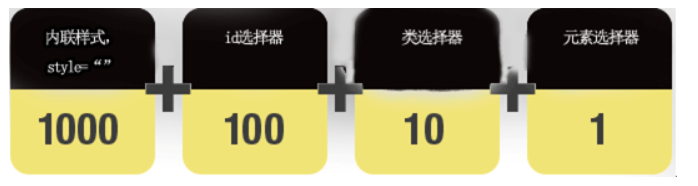

# css

### 样式是css的基本单元
**样式=选择器+声明**
### 三种格式：   内嵌 内部 外部
1. 内嵌：
```html
	<a style="color=red;"> 演示</a>
```
2. 内部:
```html
	<style>
		a{
			color:red;
		}
	</style>
```
3. 外部：
```html
	<link type="text/css" rel="stylesheet" href="url"/>
	type 属性用于设置目标文件的MIME类型，css样式表的MIME类型是text/css
	rsl属性用于设置链接目标文件与当前文档的关系，stylesheet表示外部文件的类型是css文件
```
**多重样式是指外部样式，内部样式 和内嵌样式同时应用于页面中的某个元素，，采用就近原则，内嵌>内部>外部>浏览器默认**

### 样式表的优先级
1. 优先级有一个前提：内嵌式，嵌入式，外部样式表中的样式是在相同权值的情况下才认定为就近原则 
```txt
	通用选择器*
	元素（类型）选择器
	类选择器
	属性选择器
	伪类
	ID选择器
内联样式
	！important规则例外
```
**使用！important不是一个好习惯**



### css选择器


```html
基本选择器
<style>
	a{}
	#ID{}
	.CLASS{}
    *{}
</style>
```
```html
组合选择器
<style>
	多元素选择器:同时选择多个
	p,div{}
	
	后代选择器：选择某个元素的所有后代
	div div span{}
	
	子选择器：选择儿子
	div>div>span{}
	
	相邻兄弟选择器： 选择紧接在某元素后的兄弟元素 
	div+p{}
	
	普通兄弟选择器：选择拥有相同的父元素的标签，他们之间不必紧随
	div.ll ~p{}	
    
</style>
```
```html
属性选择器
```
### css样式属性

**选择器的定义中，声明由属性和属性值构成**
**常用的有：文本 字体 背景 表格 列表 定位 等属性**


#### 文本样式

| **功 能** | **属性名**      | **描述**                                                     |
| --------- | --------------- | ------------------------------------------------------------ |
| 缩进文本  | text-indent     | 设置行的缩进大小，值可以为正值或负值，单位可以用em、px或百分比（%） |
| 水平对齐  | text-align      | 设置文本的水平对齐方式，取值left、right、center、justify     |
| 垂直对齐  | vertical-align  | 设置文本的垂直对齐方式，取值bottom、top、middle、baseline    |
| 字间距    | word-spacing    | 设置字（单词）之间的标准间隔，默认normal（或0）              |
| 字母间隔  | letter-spacing  | 设置字符或字母之间的间隔                                     |
| 字符转换  | text-transform  | 设置文本中字母的大小写，取值none、uppercase、lowercase、capitalize |
| 文本修饰  | text-decoration | 设置段落中需要强调的文字，取值none、underline（下划线）、overline（上划线）、line-through（删除线）、blink（闪烁） |
| 空白字符  | white-space     | 设置源文档中的多余的空白，取值normal（忽略多余）、pre（正常显示）、nowrap（文本不换行，除非遇到<br/>标签） |


#### 背景属性

| **功能** | **属性名**            | **描述**                                                     |
| -------- | --------------------- | ------------------------------------------------------------ |
| 背景颜色 | background-color      | 设置元素的背景色                                             |
| 背景图像 | background-image      | 设置背景图像                                                 |
| 背景重复 | background-repeat     | 设置背景平铺的方式，取值no-repeat（不平铺）、repeat-x（横向平铺）、repeat-y（纵向平铺）、repeat（x/y双向平铺） |
| 背景定位 | background-position   | 设置图像在背景中的位置，取值：top、bottom、left、right、center或具体值、百分比 |
| 背景关联 | background-attachment | 设置背景图像是否随页面内容一起滚动，取值scroll（滚动）、fixed（固定） |
| 背景尺寸 | background-size       | 用来设置背景图片的尺寸                                       |
| 填充区域 | background-origin     | 规定background-position属性相对于什么位置来定位              |
| 绘制区域 | background-clip       | 规定背景的绘制区域                                           |
| 背景简写 | background            | 在一个声明中设置所有的背景属性                               |


#### 分类属性
##### 1. cursor 属性
```text
cursor属性用于指定用户鼠标的类型。在设计表单过程中，使用图片作为提交按钮，当鼠标移动到图片上时，通常将指针改为手的形状，给予用户提示
```
##### 2.display属性
| **功能**       | **描述**		                                        |
| -----------   | -----------------------------------------------------|
| none          | 将元素设为隐藏状态                           			 |
| block         | 将元素显示为块级元素，此元素前后会带有换行符   				|
| inline        | 默认，此元素会被显示为内联元素，元素前后没有换行符      	  |
| inline-block  |行内块级												|
#### 3.float与clear属性

###### float：

| **属性值** | **描述**           |
| ---------- | ------------------ |
| left       | 元素浮动到左边界   |
| right      | 元素浮动到右边界   |
| none       | 默认值，元素不浮动 |

###### clear：

| **属性值** | **描述**                       |
| ---------- | ------------------------------ |
| left       | 清除左侧浮动产生的影响         |
| right      | 清除右侧浮动产生的影响         |
| both       | 清除两侧浮动产生的影响         |
| none       | 默认值，允许浮动元素出现在两侧 |